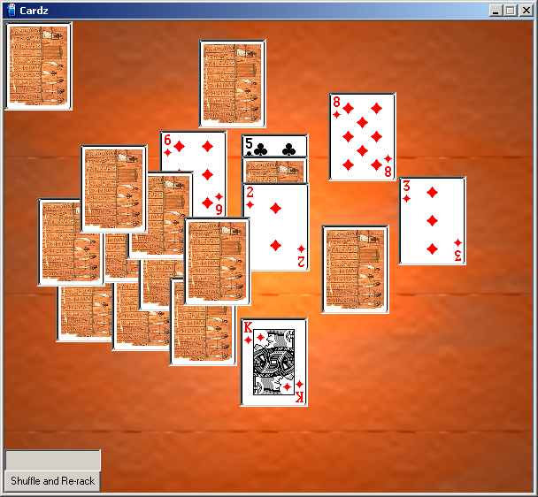

<div align="center">

## Cardz \*\*NEW\*\*


</div>

### Description

This is my first attempt at a scriptable card game, the code itself is not good at all but has got some bits going,what I intend to do is have an option to load in game scripts so that it is capable of simulating any card game. One problem I have though is not being able to obtain the Z order from a card, as it is a write only property, anyway, download it and see what you think, its got sound effects and nifty little graphics that i nicked of the web ;) lovely jubly. Please vote it if you think it's a good idea!!!
 
### More Info
 


<span>             |<span>
---                |---
**Submitted On**   |2001-07-07 18:57:44
**By**             |[Niknak\!\!](https://github.com/Planet-Source-Code/PSCIndex/blob/master/ByAuthor/niknak.md)
**Level**          |Advanced
**User Rating**    |4.2 (21 globes from 5 users)
**Compatibility**  |VB 6\.0
**Category**       |[Games](https://github.com/Planet-Source-Code/PSCIndex/blob/master/ByCategory/games__1-38.md)
**World**          |[Visual Basic](https://github.com/Planet-Source-Code/PSCIndex/blob/master/ByWorld/visual-basic.md)
**Archive File**   |[Cardz \_\_NE22379772001\.zip](https://github.com/Planet-Source-Code/niknak-cardz-new__1-24813/archive/master.zip)

### API Declarations

```
Private Declare Sub ReleaseCapture Lib "user32" ()
Private Declare Function SendMessage Lib "user32" Alias "SendMessageA" (ByVal hwnd As Long, ByVal wMsg As Long, ByVal wParam As Long, lParam As Any) As Long
Private Declare Function sndPlaySound Lib "winmm.dll" Alias "sndPlaySoundA" (ByVal lpszSoundName As String, ByVal uFlags As Long) As Long
```


